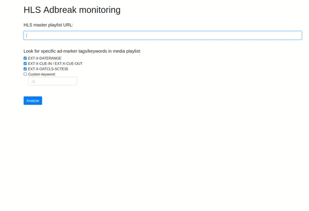

# HLS SCTE35 Monitoring Web

HLS Adbreak Monitoring is a simple HTML page that allows users to monitor HLS media playlists for specific ad-marker tags and keywords. It fetches the HLS media playlist from a given URL and periodically checks for ad-markers. Supported ad marker formats are:
- EXT-X-CUE-OUT
- EXT-X-OATCLS-SCTE35
- EXT-X-DATERANGE
- Custom user-defined tags
When it finds ad-markers, it extracts and displays SCTE35 marker information in JSON format.

## Purpose

The purpose of this project is to provide a tool for monitoring and analyzing ad-markers in HLS media playlists. This can be valuable for content creators, broadcasters, or developers who need to track and understand ad-markers for various purposes, such as ad insertion or content analytics.

## How It Works

1. **Input HLS Master Playlist URL**: Users enter the URL of the HLS master playlist they want to monitor. The page provides an input field for this purpose.

2. **Enable Preview (Optional)**: Users have the option to enable video preview if their browser supports it. This allows them to see the video while monitoring.

3. **Select Tags/Keywords to Monitor**: Users can select specific ad-marker tags/keywords to monitor by checking the corresponding checkboxes. The tags include:
   - EXT-X-DATERANGE
   - EXT-X-CUE-IN / EXT-X-CUE-OUT
   - EXT-X-OATCLS-SCTE35
   - Custom Keywords (User-defined)

4. **Start the Analysis**: Clicking the "Analyse" button triggers the analysis process. The page fetches the HLS media playlist, periodically checks for ad-markers, and displays the results.

5. **View Results**: The results are displayed in a text area, and any found ad-markers are highlighted with different colors to distinguish them. Clicking on an ad-marker displays its SCTE35 splice information in a JSON format in a modal popup.

## Demo

- Check out the [Live Demo](https://ggouzi.github.io/HLS-SCTE35-monitoring-web/) to see the project in action.

## Screencast

- Watch the  to get a visual demonstration of the interface and usage.

## Customization

You can customize this project by modifying the HTML, CSS, and JavaScript as needed. For example, you can add additional ad-marker tags or keywords, change the styling, or adapt it to your specific requirements.

## License

This project is released under the [Apache License 2.0](LICENSE).

---

**Note:** HLS-SCTE35-Monitoring-web is a side project and provided as-is. It may require adjustments and improvements to meet your specific use case.
